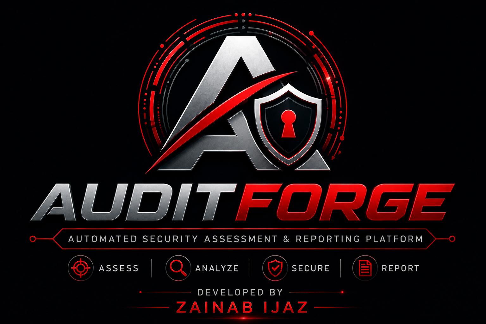

 # AuditForge

<p align="center">
  
</p>

<p align="center">
  <strong>Automated Security Assessment & Reporting Platform</strong>
</p>

<p align="center">
  Assess. Analyze. Report.
</p>

<p align="center">
  <em>Developed by Zainab Ijaz</em>
</p>

---

## About

**AuditForge** is a modular security assessment and reporting platform designed to organize authorized security assessment workflows from target validation through reconnaissance, analysis, intelligence, and reporting.

Version **1.0.0 (V1)** provides a stable command-line assessment foundation with modular assessment components and structured result handling.

> **Use only against systems and targets for which you have explicit authorization.**

## Developer

**Zainab Ijaz**  
Security Research & Development

## V1 Features

### Assessment Modules

- DNS record collection
- WHOIS information collection
- HTTP assessment
- Security header analysis
- TLS/certificate assessment
- Technology detection
- Subdomain data processing

### Analysis

- Security findings management
- Severity assessment
- Finding scoring
- Assessment risk scoring
- Finding filtering and status management

### Intelligence

- Asset inventory
- Asset normalization and deduplication
- Exposure classification
- Risk mapping
- Exposure correlation

### Reporting

- Structured JSON reports
- PDF assessment reports
- Report serialization
- Report metadata

### CLI

```text
AuditForge
├── Target validation
├── Assessment engine
├── Assessment modules
├── Analysis
├── Intelligence
└── Reporting
```

## Installation

Clone the repository:

```bash
git clone https://github.com/zainab-cyber6633/AuditForge.git
cd AuditForge
```

Install dependencies:

```bash
pip install -r requirements.txt
```

## Usage

Show help:

```bash
python -m src.auditforge --help
```

Show version:

```bash
python -m src.auditforge --version
```

Show system status:

```bash
python -m src.auditforge --status
```

Run an authorized domain assessment:

```bash
python -m src.auditforge --target example.com --target-type domain
```

Other supported target types:

```text
domain
hostname
ip
url
```

Example:

```bash
python -m src.auditforge --target https://example.com --target-type url
```


## V1 Validation

The V1 release was validated with:

- Full package import test
- Module API/signature checks
- Result model checks
- Assessment engine execution
- CLI version/status/help tests
- Target validation test
- JSON reporting test
- PDF reporting test
- Analysis API tests
- Intelligence API tests
- Compile check with Python `compileall`
- Successful assessment execution with exit code `0`

## Version

**AuditForge V1.0.0**

Current V1 is maintained as the stable CLI foundation for future development.

## Roadmap

### V1 — Stable CLI Foundation
- Modular assessment engine
- Reconnaissance modules
- Analysis layer
- Intelligence layer
- JSON/PDF reporting
- CLI

### V2 — Professional GUI
The planned V2 will build a professional desktop GUI on top of the tested V1 core, including:

- Assessment dashboard
- New assessment workflow
- Live assessment status
- Asset inventory interface
- Findings and severity views
- Risk map
- Exposure correlation
- Report management
- Professional dark security-console UI

V1 remains the stable foundation while V2 is developed separately.

## License

See [LICENSE](LICENSE) for license information.

---

<p align="center">
  <strong>AUDITFORGE</strong><br>
  Assess. Analyze. Report.
</p>
